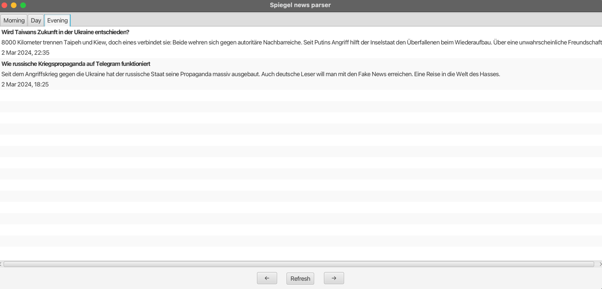

## CRON application which parses news from Spiegel website

---
It parses news from this [page](https://www.spiegel.de/thema/ukraine_konflikt/) every 20 minutes, but you can change the frequency in [application.properties](src%2Fmain%2Fresources%2Fapplication.properties) by modifying this value (use time in milliseconds) 
```
fixed-rate-ms=1200000
```


You can check these news articles in the user interface, which opens immediately after launching the app. Use the arrows to switch between them and the refresh button, which retrieves new articles from the database, if available.



---
### How to run?

---
#### Prerequisites
- Specify database credentials in [application.properties](src%2Fmain%2Fresources%2Fapplication.properties), tables will be automatically created when you run the app
- Download dependencies from [pom.xml](pom.xml) using Maven
---
After these two steps you should be able to run the application via maven using this terminal command 
```
mvn clean javafx:run
```
Or you can run it locally in Intellij Idea
- Download JavaFX 21.0.2 or later version on this [website](https://gluonhq.com/products/javafx/).
- Add configuration - 
- Edit configuration 
- Add new configuration (cmd + N on mac or find + and click there 
- Choose Application 
- in field Main Class set path to [SpiegelParserApplication.java](src%2Fmain%2Fjava%2Fnews%2Fparser%2FSpiegelParserApplication.java) -
- Open Modify option and then click Add VM option and add there next line
```
-p path/to/javafx-sdk-21.0.2/lib --add-modules javafx.controls,javafx.fxml
  ```
- Then you can run the application, but I recommend running it using Maven; it's way easier.
  
---

### Technologies
- Java 17
- Spring Boot 3
- MySQL
- Selenium
- JavaFX
- Lombok
---

